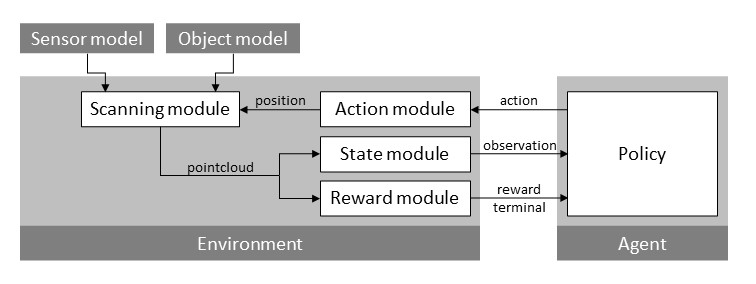
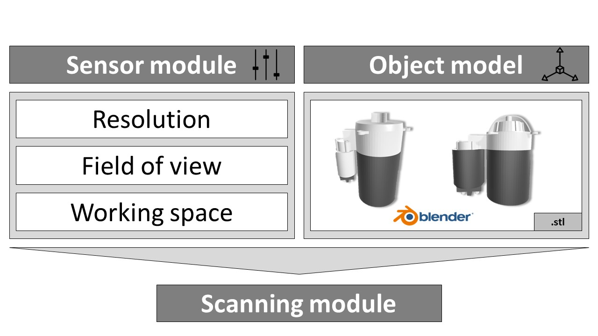
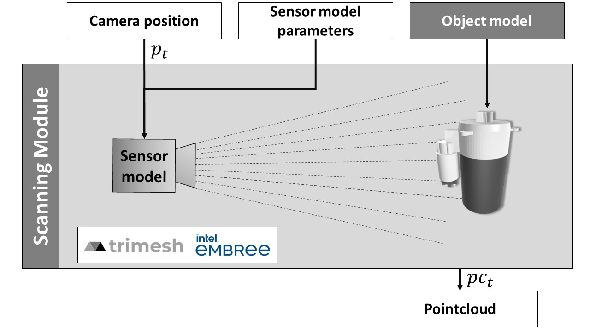
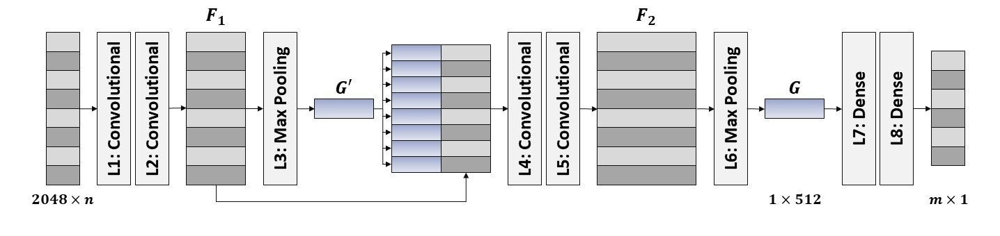

# View-Planning Simulation
This repository provides a simulation for View-Planning tasks and a reinforcement learning based approach to solve the *Coverage Problem* (maximize the covered area of an unknown product) or the *Inspection Problem* (inspect certain parts of an unknown object).
# Contributors
Contributors of the View-Planning Simulation are Dominik Koch, Jonas Schmid, Jonas Gäbele and Jan-Philipp Kaiser.
# Introduction
In remanufacturing, defects can occur on the entire surface of a used product. At the same time, it may be necessary to specifically inspect individual product features (e.g. certain components). This framework contains a simulation that can be used to solve view-planning tasks (Next-Best-View-Planning Problem (J. Banta & M. Abidi 1996), View-Planning Problem (Scott 2009), Visual Coverage Planning Problem (Jing & Goh et al. 2018) and the Inspection Problem). In addition to the actual simulation, this framework also contains suitable interfaces to enable a reinforcement learning-based solution of these view-planning tasks. The underlying principle of the overall framework is based on a simulated visual acquisition system and the principle of ray tracing. Mentioned view-planning problems always describe a problem of sequential positioning of such a visual acquisition problem to solve a given task (e.g. complete product acquisition or targeted inspection of individual product features). In addition to the use of reinforcement learning methods, the simulation framework is designed so that classical analytical solutions can also be easily implemented with suitable additional wrappers.
# View planning framework


The View planning framework consists of the simulation of a 3D camera (Environment) and the RL-Solver (Agent). This can be used to mimic the operation of an acquisition process to enable a cost-effective and time-efficient learning process of RL-agents or other approaches to solve problems in the field of view planning. 
## Simulation
### Scanning module
The scanning module consists of the *Sensor model* and the *Object model*, as described in the following.
#### Sensor model


The sensor model simulates the functionality and properties of the used depth camera. The configuration options consist of the selection of the following parameters:

- Resolution
- Field of view (fov)
- Working space

While the *resolution* and *field of view* are well-known parameters in the field of camera systems, the *working space* of our simulated depth camera specifies an interval in terms of the distance between sensor and object (which is placed in the coordinate origin). If the distance between camera and the intersection point of the ray with the object is not in the defined interval, the respective point cannot be seen.

#### Object model
The object model must be in the .stl format. The simulation loads one out of all available objects. In addition to objects from the abc data set, own objects can also be used.
#### Scanning module
The *scanning module* connects the sensor and object model. In doing so it receives from the RL agent a camera pose consisting of x, y, and z coordinates and three angles to rotate the camera. After simulating the camera pose, a point cloud is returned. The Python package *Trimesh* in combination with the Intel hardware optimization *Embree* enable efficient ray tracing to recreate a depth camera shot. Here, a virtual camera and the object used in the epoch is placed in space. Depending on the sensor model (resolution, aperture angle and working range), rays are defined starting from the focal point. The coordinate of each first intersection point of the rays with the object defines here a point in the point cloud, which is defined in a global coordinate system.



## RL-Solver
### State
In every interaction between agent and environment the agent receives a state. There are generally three possibilities to choose. All of them have in common, that the point clouds are downsampled to a defined dimension.
1.	**State as captured point cloud**: This possibility is based on total point cloud, which is acquired up to the current time. For that, no model is required at runtime.
2.	**Inverted point cloud**: Here, all the points which have not already been seen, are returned. For that, a model of the object is needed.
3.	**Binary state encoding**: This possibility returns the point cloud of the whole object. For each point the information is provided whether a point has already been seen or not. For that, a model is also required.

### Action
The action consists out of translation (position of the scanner) and rotation (of the camera) and varies in the degrees of freedom. The translation can either be defined in the cartesian coordinate system as x, y, and z coordinates or in the spherical coordinate system. The camera rotation can either be done through the action or by an automatic centering to the object/origin.

### Reward
In order to learn a desired behavior that solves the problem as good as possible and to continuously evaluate the actions performed, an RL agent receives feedback in the form of a numerical reward. Besides sparse rewards rewarding actions by the end of an epoch, there are dense rewards which return a reward after each scan. 
The following aspects can be relevant for calculating the reward:

- Captured surface of the object
- Not captured surface of the object
- Number of required captures
- Length of travel paths

### Agent
As agent  a neural network to approximate the policy is defined as well as a configuration of numerous parameters. The first part, a shared feature extractor, is based on the encoder of the [point completion network](https://arxiv.org/abs/1808.00671?context=cs.RO). After the latent dimension, multiple MLP layers are added for each network. Furthermore, Stable Baselines offers different [RL agents](https://stable-baselines3.readthedocs.io/en/master/modules/base.html) (PPO, A2C, SAC, …) that can be applied.



# How to run

1. Define the parameters for environment, agent and tracking in the config file: `config.yaml`
2. Execute the `Gym_Framework.py` file with the config via ```python Gym_Framework.py config.yaml```
3. Additional information about adjustable parameters can be obtained by adding `–[h]` after the command 
4. Tracking of the training is performed in Weight and Biases. At the first start you will have to enter your wandb API key (can be found under [https://wandb.ai/settings](https://wandb.ai/settings) if you are logged in) in your terminal. 

# Installation

So far, installation and running was tested with Linux (Ubuntu 20.04.4 LTS) with root, Windows does not support the raytracing optimization package *Embree*

Install the required packages in Python 3.7 through

`pip install -r requirements.txt`

To use the optimization of raytracing embree hast to be installed:

`conda install -c conda-forge pyembree`

*Cuda is not necessary but improves computing time immensely.* To check if CUDA is available for graphic card and which version is supported:

`nvidia-smi`

If CUDA is available, go to [https://pytorch.org/get-started/locally/](https://pytorch.org/get-started/locally/) and choose the right options (pytorch 1.12). Use the official command from the website to install pytorch.

If cuda is not available, install pytorch 1.12 for CPU.

# Acknowledgements

# References

> J. E. Banta, & Mongi A. Abidi (1996). Autonomous placement of a range sensor for acquisition of optimal 3-D models. Proceedings of the 1996 IEEE IECON. 22nd International Conference on Industrial Electronics, Control, and Instrumentation, 3, 1583-1588 vol.3.

> Scott, W. (2009). Model-based view planning. Machine Vision and Applications, 20(1), 47–69. 

> Jing, W., Goh, C., Rajaraman, M., Gao, F., Park, S., Liu, Y., & Shimada, K. (2018). A Computational Framework for Automatic Online Path Generation of Robotic Inspection Tasks via Coverage Planning and Reinforcement Learning. IEEE Access, 6, 54854–54864.


